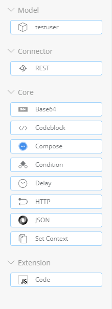
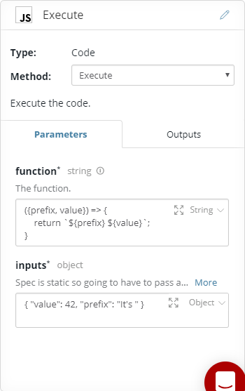
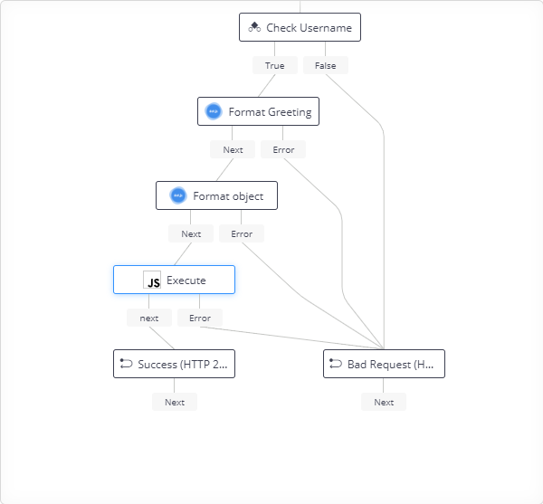

# api-builder-plugin-gm-code

The Code plugin allows you to execute Javascript code inside a Flow. 

> Note the function has access to global scope and so you should never execute a function received from an untrusted source.

Once installed the Code flow node will show up in the "Extensions" section of the Flow Editor tool panel.



### Exectute
The _Execute_ method executes the specified function. As the Flow Node spec cannot define dynamic inputs the node instead makes use of ES6 destructuring.



| Param | Type | Required | Description |
| --- | --- | --- | --- |
| function | string | y | The function to execute. When called it will receive `inputs` as the only arguments. Using destructuring makes this easier to consume. |
| inputs | object | y | The parameters to pass to the function when executing. |

The node has two outputs, `next` and `error`. The `error` output is triggered if the function throws an exception, otherwise the `next` output is triggered with the return value of the function.



## About flow-nodes

Flow-nodes are used within [Axway API Builder's](https://www.axway.com/en/datasheet/axway-api-builder)
flow editor that is a low-code / no-code solution to designing and developing services
that integrate to many different connected components, such as databases and APIs.

## Getting started

1. Follow the [Getting Started Guide](https://docs.axway.com/bundle/API_Builder_4x_allOS_en/page/api_builder_getting_started_guide.html) to create an API Builder service
1. Follow the [Axway Flow SDK](https://docs.axway.com/bundle/API_Builder_4x_allOS_en/page/axway_flow_sdk.html) guide to get started creating flow-node plugins.

## Install

After creating your API Builder service (`api-builder init`), you can install this plugin using npm:

```
npm install --save @bladedancer/api-builder-plugin-gm-code
```
